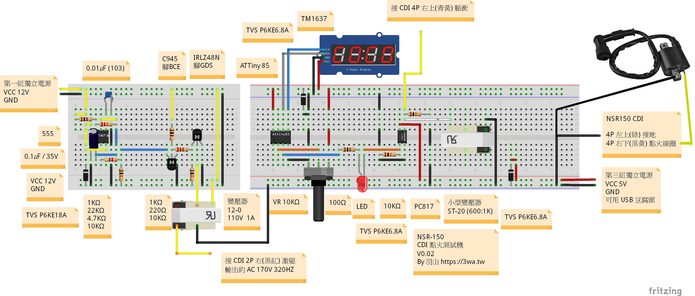

# NSR CDI Tester

這是一個用於測試 NSR CDI 點火模組是否正常運作的小型測試平台。

- 作者：羽山 ([https://3wa.tw](https://3wa.tw))  
- 版本：v0.02

---

## 功能介紹

1. **激磁電源模組**  
   使用 555 PWM 模組產生約 320Hz 訊號，驅動 C945 三極體，進而控制 IRLZ48N MOSFET 切換電流。  
   將 DC 12V 轉換為高壓 AC 約 170V，用作 CDI 模組的激磁電源（Exciter Power）。

2. **模擬點火訊號產生器**  
   使用 ATTiny85 微控制器讀取可變電阻輸入，模擬引擎轉速（RPM），產生對應頻率的點火脈衝輸出：  
   - 範圍：0 ~ 14,000 RPM  
   - 脈衝寬度：91.6% Duty（對應 30° 進角 / 360°）  
   - 模擬反向電動勢行為，輸出與 NSR CDI 相容的觸發訊號  
   - 使用 TM1637 4 位元七段顯示器即時顯示模擬轉速

3. **電源需求**
   - DC 12V @ 5A（供給激磁電路）
   - DC 5V @ 1A 以上（供給數位電路及光耦隔離使用，與主電源分離以避免共地干擾）

---

## 電路圖

---

## 實機影片展示

📹 [點我觀看示範影片（2025-06-29）](snapshot/20250629_NSRCDI_Tester.mp4)

---

## 注意事項

- 本測試平台僅供開發與維修用途，請勿直接應用於實際車輛上。
- 高壓區段具觸電風險，請注意安全與絕緣。
- 建議於使用時搭配點火線圈與火星塞以模擬真實負載狀況。
- 火星塞蓋與火星塞選用有電阻型的避免 EMP 造成 ATTiny85 Crash

---

## 待辦事項 / 未來改進

- [ ] 增加電壓/電流保護功能
- [ ] 逆變器變壓器發熱問題
- [ ] 開關電源模組

---

## 授權

本專案以 MIT License 授權使用。
